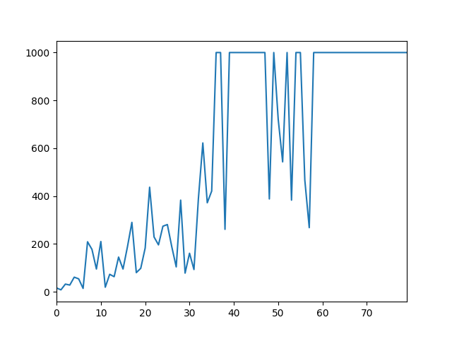
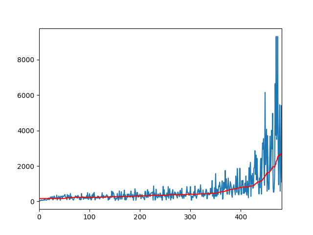
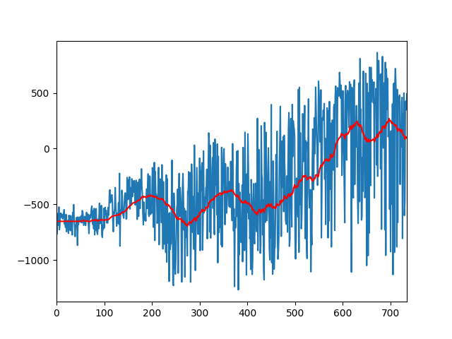
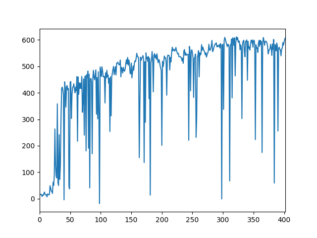
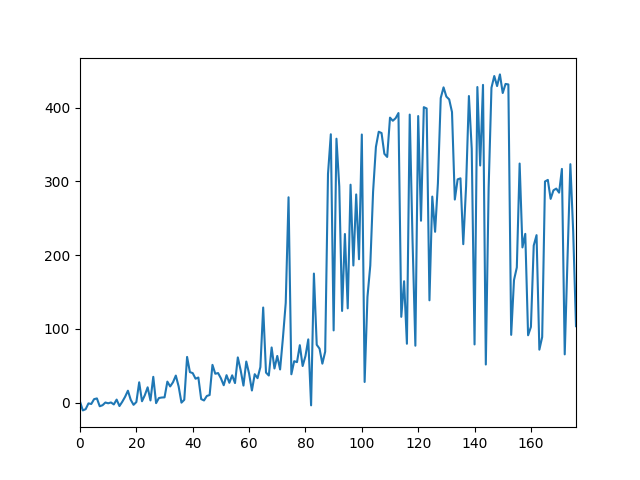

## Overview

This is the code for [this](https://youtu.be/DzzFSyzv1p0) video on Youtube by Siraj Raval on OpenAI Five vs DOTA 2. The author of this code is [alexis-jacq](https://github.com/alexis-jacq/Pytorch-DPPO). The real code is not yet publically available, but this is a basic version of the algorithm. 

# Pytorch-DPPO
Pytorch implementation of Distributed Proximal Policy Optimization: https://arxiv.org/abs/1707.02286
Using PPO with clip loss (from https://arxiv.org/pdf/1707.06347.pdf).

I finally fixed what was wrong with the gradient descent step, using previous log-prob from rollout batches. At least ppo.py is fixed, the rest is going to be corrected as well very soon.

In the following example I was not patient enough to wait for million iterations, I just wanted to check if the model is properly learning:

Progress of single PPO:
-----------------------
InvertedPendulum

InvertedDoublePendulum

HalfCheetah

hopper (PyBullet)

halfcheetah (PyBullet)

Progress of DPPO (4 agents) [TODO]

## Acknowledgments
The structure of this code is based on https://github.com/ikostrikov/pytorch-a3c.

Hyperparameters and loss computation has been taken from https://github.com/openai/baselines
